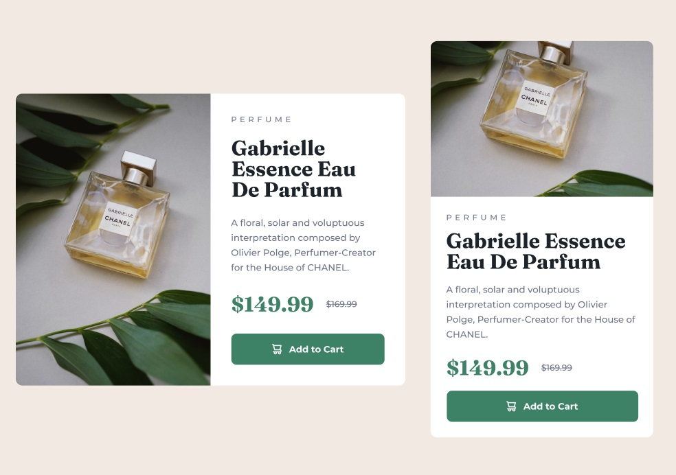

<!-- @format -->

# Frontend Mentor - Recipe page solution

This is a solution to the [Recipe page challenge on Frontend Mentor](https://www.frontendmentor.io/challenges/recipe-page-KiTsR8QQKm). Frontend Mentor challenges help you improve your coding skills by building realistic projects.

## Table of contents

-   [Overview](#overview)
    -   [Screenshot](#screenshot)
-   [My process](#my-process)
    -   [Built with](#built-with)
    -   [What I learned](#what-i-learned)
    -   [Continued development](#continued-development)
-   [Author](#author)

## Overview

Deep dive into B.E.M.
Mobile first aproach
trying to save some bandwidth and made smaller picture for mobile resolution, and used "Art direction" and "Resolution switching" technique for retina displays.
also i compress jpeg to webp.
i saved lots of kilobytes. And it has some role in SEO evaluation.

Pseudoelements ::before for <ol></ol> list item

### Screenshot



## My process

1. NPM init
2. NPM install all my dev dependencies
   gulp - autoprefixer - webp - css-flatten
   sass
   git
3. git init
4. gihub remote
5. selfhost and set fonts
6. set color pallet to my variables maps
7. calculate font sizes and line-heights to REMs and EMs
8. HTML structure with B.E.M. - resolution switching and art direction for images.
9. DiVe into coding in Sass
10. Mediaqueries
11. testing
12. hosting to github
13. Submit solution to Frontend Mentor

### Built with

-   Semantic HTML5 markup
-   Picture resolutin
-   CSS custom properties - BEM naming convention
-   Flexbox
-   Mobile-first workflow

### What I learned

<p>"Art direction" and "Resolution switching"</p>

```html
<picture>
    <source
        media="(max-width: 650px)"
        type="image/webp"
        width="343"
        height="240"
        sizes="(min-width:343px) 343px, 100vw"
        src="(max-width:343px)"
        srcset="
            ./assets/img/mobile-343-test.webp 343w,
            ./assets/img/mobile-686-test.webp 686w
        "
    />
    
</picture>
```

Here i am self-hosting fonts compressed it to woff2,
fallback to ttf.

```css
@font-face {
    font-family: 'Young Serif';
    src: url(../assets/webfonts/Font-face/YoungSerif-Regular.woff2) format('woff2'),
        url(../assets/webfonts/Font-face/YoungSerif-Regular.ttf) format('truetype');
    font-weight: 400;
}
```

### Continued development

Practise, practise, practise.

### Useful resources

-   [Design Course](https://www.youtube.com/watch?v=er1JEDuPbZQ&t=2s&ab_channel=DesignCourse) - Nice explanation of B.E.M.
-   [MDN](https://developer.mozilla.org/en-US/docs/Learn/HTML/Multimedia_and_embedding/Responsive_images) - Picture element in responsive design.
-   [Kevin Powell](https://www.youtube.com/watch?v=Rik3gHT24AM&t=979s&ab_channel=KevinPowell) - Demonstration img sourceset: how to use it in the code.

## Author

-   Website - [Mirjax Vigokiller](https://github.com/Mirjax2000)
-   Frontend Mentor - [@Mirjax2000](https://www.frontendmentor.io/profile/Mirjax2000)

## Acknowledgments

I received big help, lots of motivativation and many new usefull tips and tricks from this user [@stevexero](https://www.frontendmentor.io/profile/stevexero), He doesnt know that but i am watching his challenges and learnig from him.
